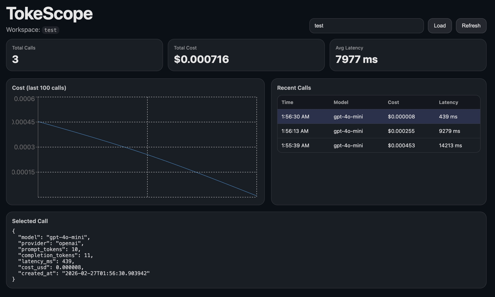

# TokeScope

TokeScope is a lightweight LLM observability tool.

It instruments LLM API calls and tracks:

- Token usage
- Cost (USD)
- Latency
- Model usage
- Errors

Built as a minimal, infrastructure-focused alternative to LangSmith / Helicone.

---

## Dashboard



---

## Architecture

User App  
→ TokeScope SDK (async batching)  
→ FastAPI ingest service  
→ PostgreSQL  
→ React dashboard

---

## Quickstart (Local)

Start backend:

```bash
docker compose up -d
python -m uvicorn backend.main:app --reload --port 8000
```

## Start Dashboard
```
cd dashboard
npm install
npm run dev
```
## Example App
```
import tokescope

tokescope.init(api_key="test")

from openai import OpenAI
client = OpenAI()

client.chat.completions.create(
    model="gpt-4o-mini",
    messages=[{"role": "user", "content": "Hello"}]
)
```
Visit: `http://localhost:5173`

## Key Design Decisions
- Async, non-blocking telemetry
- Privacy-first default (`capture_content=False`)
- Workspace isolation via API key
- Backend-generated request IDs
- Persistent aggregation with PostgreSQL
