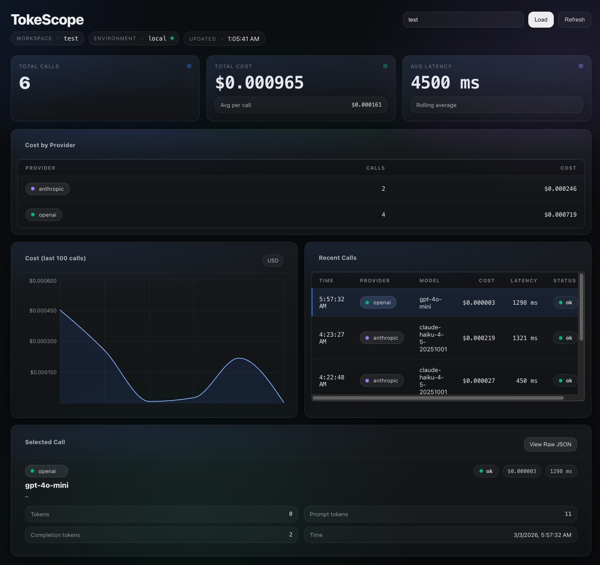

# TokeScope

TokeScope is a lightweight, self-hosted LLM observability platform.

It instruments LLM API calls and tracks:

- Token usage
- Cost (USD)
- Latency
- Model usage
- Errors
- Provider-level breakdowns

Built as a minimal, infrastructure-focused alternative to LangSmith / Helicone.

---

## Dashboard

<p align="center">
  
</p>

---

## Architecture

User App  
→ TokeScope SDK (async batching + provider patchers)  
→ FastAPI ingest service  
→ PostgreSQL  
→ React dashboard

---

## Quickstart (Local)

### 1. Start Backend

```bash
docker compose up -d
python -m uvicorn backend.main:app --reload --port 8000
```

### 2. Start Dashboard

```bash
cd dashboard
npm install
npm run dev
```

Visit:

```
http://localhost:5173
```

---

## Instrument an App

```python
import tokescope
from openai import OpenAI

tokescope.init(api_key="test")

client = OpenAI()

client.chat.completions.create(
    model="gpt-4o-mini",
    messages=[{"role": "user", "content": "Hello"}]
)

# Optional: force flush for short scripts
tokescope.flush()
```

---

## Key Design Decisions

- **Async, non-blocking telemetry** via background batching worker
- **Provider patchers** for OpenAI, Anthropic, Ollama
- **Privacy-first default** (`capture_content=False`)
- **Workspace isolation** via API key
- **Backend-generated request IDs**
- **Persistent aggregation** with PostgreSQL
- **Explicit `flush()` API** for deterministic telemetry delivery

---

## Why This Exists

Modern teams need observability for LLM workloads — especially when running local or open-source models.

TokeScope focuses on:

- Self-hosted deployment
- Minimal dependencies
- Cost transparency
- Clear infrastructure boundaries
- Extensible provider instrumentation

---

MIT License
